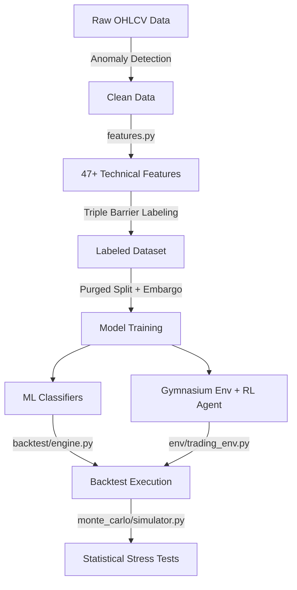

# MASTER_CONTEXT.md

## Meta Information
* **Generation Timestamp**: 2026-05-19T20:30:00+07:00
* **Total Markdown Files Analyzed**: 4
* **Major Topics Discovered**: Quantitative trading, machine learning pipelines, reinforcement learning, data leakage audit, risk management, Monte Carlo simulation, purged walk-forward validation.
* **Estimated Repository Focus**: Clean, leakage-free institutional-grade algorithmic trading engine for Gold Futures (GC=F).

---

# PROJECT OVERVIEW

This repository implements **MLRL01**, a production-grade Machine Learning (ML) and Reinforcement Learning (RL) trading engine optimized for Gold Futures (`GC=F`). The core design philosophy is **strict realism** over inflated metrics, enforcing a 100% data-leakage-free modeling pipeline.

### Core Goals
1. **Eliminate Leakage**: Restructure raw indicator computation and train/test validation boundaries to prevent future information lookahead.
2. **Realistic Execution**: Incorporate transaction costs (slippage, fees, spread) and execution delays (enter/exit on next bar).
3. **Rigorous Validation**: Use Purged Walk-Forward Cross-Validation with an embargo gap, and Regime-Aware Monte Carlo simulation.
4. **Active Risk Controls**: Enforce drawdown kill switches, daily loss limits, and consecutive loss limits.

---

# ARCHITECTURE

The pipeline operates in a sequential, modular data flow:



### Core Components & Modules

1. **Feature Pipeline (`features/features.py` & `features/indicators.py`)**
   * Processes raw price data to generate technical indicators and market regime features.
   * Forces a `shift(1)` lag across all feature steps to ensure models only observe historical data available prior to execution time.

2. **Gymnasium Environment (`env/trading_env.py`)**
   * Custom trading simulation environment (`TradingEnv`) inheriting from OpenAI Gym.
   * Action space (5-action discrete): `[Flat, Long 50%, Long 100%, Short 50%, Short 100%]`.
   * Enforces holding constraints (`min_hold_period`), cooldowns, and a portfolio drawdown kill switch.
   * Uses **Differential Sharpe Ratio (DSR)** as the reward function, augmented by transaction cost and overtrading penalties.

3. **Risk Management (`risk/risk_manager.py`)**
   * Computes risk metrics (Sharpe, Sortino, Calmar, Win Rate, Tail Ratio, Profit Factor).
   * Implements ATR-based position sizing, Kelly criterion (half-Kelly), and circuit breakers (daily loss limit, max consecutive losses).

4. **Walk-Forward Validation (`train_wf.py`)**
   * Implements a sliding window cross-validation (typically 3 years training, 1 year testing) with a 60-bar embargo gap to prevent information bleed across fold boundaries.
   * Supports training PPO and RecurrentPPO (LSTM) policies.

5. **Backtest Engine (`backtest/engine.py` & `backtest/benchmarks.py`)**
   * Simulates trade execution using real friction (fees, spread, slippage) and execution delays (market entry on the next bar).
   * Runs baseline benchmarks: Buy & Hold, SMA Crossover, and Random.

6. **Monte Carlo Simulator (`monte_carlo/simulator.py`)**
   * Evaluates strategy survival across 1000+ simulations.
   * Implements block bootstrap (preserving serial correlation), regime-aware bootstrap, and extreme stress testing (crashes and spread explosions).

---

# IMPORTANT CONTEXT

### The Data Leakage Audit
Historically, previous versions of this repository achieved **95-100% ML accuracy** due to severe lookahead bias. A comprehensive audit identified and resolved **14 critical leakage sources**:
* **Target Leakage**: Replaced simple tomorrow-lookahead binary targets with De Prado's Triple Barrier Method.
* **Feature Leakage**: All rolling indicator variables now strictly use `shift(1)` lag.
* **Validation Leakage**: Split boundaries are now protected by a 60-bar embargo gap.
* **RL State Leakage**: The RL observation state was updated to observe features at index `current_step - 1` rather than the active step, preventing the model from seeing the current bar's close price before making its trade decision.

> [!IMPORTANT]
> Post-audit, ML accuracy dropped to a realistic **51-58%**. This is expected behavior. In daily quantitative trading, a 52-58% directional win rate combined with proper risk-to-reward ratios is realistic and can be highly profitable.

---

# AI/ML NOTES

### Models Used
* **Classical ML**: Logistic Regression, Decision Tree, Random Forest, Gradient Boosting, XGBoost, LightGBM, SVM.
* **Deep RL**: PPO (Proximal Policy Optimization) and RecurrentPPO (LSTM-based PPO for temporal dependencies).

### Features
* **Trend**: Close price normalized against EMA20/EMA50, EMA slopes, and ADX.
* **Volatility**: Rolling standard deviations (20/60 days), vol ratios, and ATR values.
* **Mean Reversion**: Bollinger Band z-scores and VWAP distance.
* **Momentum**: RSI, normalized MACD, and MACD Histograms.
* **Higher-Order Stats**: Rolling skewness and kurtosis.
* **Market Structure**: Distances from rolling highs/lows, breakout volumes, and weekly/daily trend alignments.
* **Regime Flags**: Categorical indicators representing `trending`, `volatile`, and `sideways` states.

### Evaluation Methods
* **Purged Cross-Validation**: Folds separated by a 60-bar embargo.
* **Statistical Bootstrap**: 1000-sim block bootstrap and regime-aware sampling.
* **Stress Tests**: Sudden price crashes (-5%) and spread expansions (5x).

---

# ENGINEERING NOTES

### Technical Dependencies
Declared dependencies in `requirements.txt`:
* Data Analysis: `pandas`, `numpy`, `pyyaml`
* ML / Modeling: `scikit-learn`, `xgboost`, `lightgbm`
* RL: `stable-baselines3`, `gymnasium` (Optional: `sb3-contrib` for RecurrentPPO)
* Visualization: `matplotlib`
* Utility: `yfinance`, `schedule`, `requests`

### Friction Configs (`configs/config.yaml`)
* Initial Capital: `$100,000`
* Fee Rate: `0.0001` (0.01%)
* Spread Cost: `0.0003` (0.03%)
* Slippage: `0.0002` (0.02%)
* Total transaction cost applied on both entry and exit: `0.06%` of trade volume.

---

# EXPERIMENTS & FINDINGS

### Model Benchmarks (V4 Clean Test Results)

| Strategy / Model | Return | Sharpe Ratio | Max Drawdown | Trades |
| :--- | :---: | :---: | :---: | :---: |
| **Buy & Hold (Benchmark)** | **+126.95%** | **1.485** | **—** | 1 |
| **SMA Crossover (Benchmark)** | **+86.02%** | **1.292** | **—** | — |
| Logistic Regression | +16.03% | 0.486 | -10.4% | 110 |
| Decision Tree | +10.80% | 0.604 | -3.8% | 35 |
| Gradient Boosting | -1.99% | -0.026 | -10.6% | 103 |
| SVM | -10.33% | -0.263 | -15.4% | 127 |
| PPO (RL Agent) | -13.94% | -0.183 | -20.14% | 72 |
| LightGBM | -16.13% | -0.631 | -16.1% | 123 |
| Random Forest | -17.64% | -0.713 | -17.9% | 108 |
| XGBoost | -18.57% | -0.835 | -18.6% | 119 |

### Critical Observations
* **Simple Models Excel**: Logistic Regression and Decision Trees outperformed complex ensembles (RF, LightGBM, XGBoost) and RL agents. This is standard in noisy daily return datasets where high-complexity models quickly overfit to market noise.
* **Underperforming Buy & Hold**: None of the active models outpaced Buy & Hold on Gold Futures during the 2010-2026 period due to a persistent Gold bull market and compounding transaction fees ($30k+ on active strategies).

---

# TODO / ROADMAP

1. **Scale RL Training**: Increase RL timesteps from 50k/100k to 500k–1M to stabilize policy convergence.
2. **Optimize Hyperparameters**: Integrate `Optuna` tuning for ML model depth/learning rates and RL entropy coefficients.
3. **Sequence Memory**: Implement RecurrentPPO (LSTM) natively with optimized sequence lengths (12-24 bars).
4. **Reduce Overtrading**: Tighten the trade rate penalty in `TradingEnv` to prioritize high-conviction entries.
5. **Feature Reduction**: Utilize SHAP values to identify and prune noise-inducing features.

---

# KNOWN ISSUES & WEAKNESSES

* **Noise on Daily Bars**: Daily commodity markets have low signal-to-noise ratios. Active models struggle to cover transaction friction.
* **Warm-up Warm-Down Data Discard**: `features.py` discards the first 100-250 rows to initialize moving average buffers, requiring a minimum raw data size of at least 1,000 rows.
* **Regime Shifts**: Strategy performance degrades significantly during transition periods (e.g., sideways to trending volatile).

---

# QUICK START CONTEXT

An agent looking to run the system immediately should execute:

```powershell
# 1. Verify environment and features
python MLRL01/quick_test.py

# 2. Run the main ML training & MC simulator pipeline
python MLRL01/main.py

# 3. Train the Walk-Forward RecurrentPPO Agent (LSTM)
python MLRL01/train_wf.py --timesteps 100000 --train_years 3 --test_years 1
```

---

# FILE MAP SUMMARY

* `main.py`: Entrypoint orchestrating data cleaning, feature generation, model training, risk evaluation, and Monte Carlo runs.
* `train_wf.py`: Orchesrates the sliding walk-forward LSTM RL training process.
* `features/`:
  * `features.py`: The production feature builder and target labeling logic.
  * `indicators.py`: Reusable mathematical functions for indicators.
* `env/trading_env.py`: Gymnasium env defining states, actions, friction, and DSR rewards.
* `risk/risk_manager.py`: Performance metrics calculation and risk-based breakers.
* `backtest/`:
  * `engine.py`: Runs realistic backtests with transaction costs and execution delays.
  * `benchmarks.py`: Houses baseline strategies (Buy & Hold, SMA, Random).
* `monte_carlo/simulator.py`: Implements block bootstrap and stress simulators.
* `configs/config.yaml`: Centralized configuration variables for features, env, and models.
